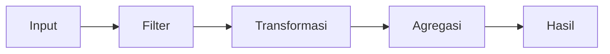

# Judul Query

- **ID:** FSQ-CATEGORY-NNN
- **Judul Inggris:** Judul deskriptif
- **Jenis:** FortiSIEM search type, SQL dialect
- **Status privasi:** Tersanitasi
- **Status pengujian:** Belum diuji atau daftar versi yang benar-benar diuji

Hapus seluruh petunjuk dalam template ini setelah dokumentasi selesai.

## Tujuan

Jelaskan pertanyaan yang dijawab query, konteks penggunaan, dan apa yang tidak
dapat dibuktikan oleh hasilnya.

## Parameter

| Parameter | Bentuk nilai | Kegunaan |
| --- | --- | --- |
| `PARAMETER_NAME` | Tipe atau format | Penjelasan tanpa nilai lingkungan nyata |

Jelaskan validasi nilai, batas inklusif atau eksklusif, dan aturan quoting.

## Alur Perhitungan

Buat satu subbagian untuk setiap CTE, subquery, window, join, filter penting,
dan `SELECT` akhir. Gunakan nama simbol yang sama dengan SQL agar penjelasan
dapat ditelusuri.

### 1. Nama blok pertama

Jelaskan input, filter, fungsi, output antara, dan alasan blok diperlukan.

### 2. Nama blok berikutnya

Jelaskan bagaimana blok ini menggunakan hasil sebelumnya dan bagaimana edge
case diperlakukan.

## Formula

Tuliskan formula utama dan definisikan setiap variabel serta satuannya.

## Kolom Hasil

| Kolom | Arti |
| --- | --- |
| `Column Name` | Interpretasi dan satuan |

## Asumsi dan Keterbatasan

- Sebutkan asumsi tentang sumber event dan makna setiap sinyal.
- Jelaskan kemungkinan false positive, false negative, data kosong, dan delay.
- Jelaskan hal yang tidak dihitung, misalnya maintenance window.
- Jangan menyatakan kompatibilitas versi yang belum diuji.

## Validasi yang Disarankan

Daftar skenario non-production dengan hasil yang telah diketahui, termasuk
normal case, gap, batas waktu, data kosong, dan input tidak valid.

## Catatan Performa

Jelaskan time bound, filter indeks, cardinality, join, window, LIMIT, dan risiko
periode pencarian panjang.

## Referensi Resmi

- [Judul halaman resmi](https://docs.fortinet.com/)

Catat versi dokumentasi dan tanggal akses. Gunakan tautan serta ringkasan
orisinal; jangan menyalin materi pihak lain.

Fortinet, FortiSIEM, dan merek terkait adalah milik pemegang mereknya. Proyek ini
independen dan tidak berafiliasi, disponsori, atau didukung oleh Fortinet.