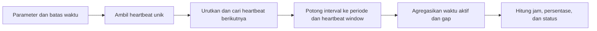

# Uptime Teramati Satu Kolektor dari Heartbeat Sistem

- **ID:** FSQ-AVAIL-001
- **Judul Inggris:** Observed Single-Collector Uptime from System Heartbeats
- **Jenis:** FortiSIEM Advanced Search, ClickHouse SQL
- **Status privasi:** Tersanitasi
- **Status pengujian:** Belum dieksekusi secara independen pada lingkungan FortiSIEM

## Tujuan

Query ini memperkirakan ketersediaan satu kolektor berdasarkan kontinuitas event
heartbeat sistem. Setiap heartbeat memberikan kredit waktu aktif paling lama
sebesar `HEARTBEAT_WINDOW_SECONDS`. Jeda setelah batas tersebut dianggap sebagai
waktu tidak teramati aktif.

Hasilnya adalah **observed heartbeat availability**, bukan bukti langsung bahwa
host, seluruh proses kolektor, jalur jaringan, dan layanan FortiSIEM selalu sehat.

## Parameter

Isi parameter hanya pada salinan lokal yang tidak dilacak Git. Jangan commit
query yang sudah berisi nilai lingkungan nyata.

| Parameter | Bentuk nilai | Kegunaan |
| --- | --- | --- |
| `PERIOD_START` | `YYYY-MM-DD HH:MM:SS` | Awal periode, inklusif |
| `PERIOD_END` | `YYYY-MM-DD HH:MM:SS` | Akhir periode, eksklusif |
| `TIMEZONE` | Nama zona waktu IANA | Interpretasi kedua batas waktu |
| `CUSTOMER_NAME` | String | Nilai organisasi pada deployment target |
| `COLLECTOR_ID` | Bilangan bulat tanpa tanda | ID kolektor target |
| `COLLECTOR_NAME` | String | Nama reporting device kolektor target |
| `HEARTBEAT_WINDOW_SECONDS` | Bilangan bulat positif | Masa berlaku satu heartbeat |
| `TARGET_PERCENT` | Angka 0 sampai 100 | Ambang status akhir |

`PERIOD_END` wajib lebih besar daripada `PERIOD_START`, heartbeat window wajib
positif, dan target wajib berada pada rentang 0 sampai 100. Query menandai input
yang melanggar aturan tersebut sebagai tidak valid, tetapi input tetap harus
divalidasi sebelum eksekusi. Nilai string yang mengandung tanda petik tunggal
harus ditangani dengan aman sebelum ditempelkan ke Query Console.

## Contoh Dummy Siap Copy-Paste

Buka [query.example.sql.tmpl](query.example.sql.tmpl), lalu salin seluruh isinya
ke **Analytics > Advanced Search > Query Console**. Contoh tersebut sudah berisi:

| Parameter | Nilai dummy |
| --- | --- |
| Organisasi | `Dummy_Organisasi` |
| ID kolektor | `999999` |
| Nama kolektor | `Dummy_Kolektor` |
| Period start | `2026-08-17 00:00:00` |
| Period end | `2026-08-18 00:00:00` |
| Timezone | `UTC` |
| Heartbeat window | `600` detik |
| Target | `90` persen |

ID kolektor wajib numerik. Jangan mengganti `999999` dengan
`ID_Dummy_Kolektor`. Penulisan tanggal juga harus `2026-08-17`, bukan
`17-08-2026`. Query dummy dapat langsung di-format dan dijalankan, tetapi hasil
kosong adalah wajar karena organisasi dan kolektornya tidak nyata.

Untuk memperoleh hasil deployment, ubah dummy hanya pada salinan lokal yang
tidak dilacak Git, lalu copy-paste seluruh query. Jangan commit salinan tersebut.

## Alur Perhitungan

### 1. Parameter dan batas waktu

Bagian awal `WITH` mengubah batas waktu menjadi `DateTime`, menyimpan identitas
target sebagai alias, dan menghitung panjang periode dalam detik.

- `period_start` dan `period_end` membentuk interval setengah terbuka
  `[period_start, period_end)`.
- `heartbeat_window_seconds` menentukan berapa lama sebuah heartbeat masih
  dianggap mewakili kondisi aktif.
- `total_seconds` menjadi penyebut persentase uptime.
- `nonzero_total_seconds` membuat penyebut menjadi `NULL` ketika panjang periode
  nol, sehingga ekspresi persentase tidak membagi dengan nol.

Zona waktu diparameterkan karena penggunaan zona waktu yang salah dapat
menggeser batas pencarian dan mengubah hasil.

### 2. `heartbeat_times`

CTE ini membaca `fsiem.events` dan mengambil `phRecvTime` yang unik.

- Pencarian dimulai satu heartbeat window sebelum `period_start`. Lookback ini
  memungkinkan heartbeat sebelum periode memberi kredit ke bagian awal periode.
- `phRecvTime < period_end` menjaga batas akhir tetap eksklusif.
- Filter organisasi, ID kolektor, dan nama kolektor membatasi hasil ke satu
  target tertentu.
- `startsWith(eventType, 'PH_SYSTEM_')` membatasi data ke keluarga event sistem.
- `DISTINCT` mencegah timestamp heartbeat yang sama dihitung lebih dari sekali.

Pastikan prefix event tersebut memang merepresentasikan heartbeat yang dimaksud
pada deployment target. Kesamaan prefix tidak otomatis menjamin semua event
memiliki makna kesehatan yang sama.

### 3. `ordered_heartbeats`

`leadInFrame` memasangkan setiap heartbeat dengan heartbeat berikutnya setelah
data diurutkan berdasarkan waktu. Frame eksplisit dari awal sampai akhir dataset
memastikan fungsi dapat melihat baris berikutnya di seluruh hasil.

Untuk heartbeat terakhir, `period_end` dipakai sebagai nilai pengganti. Dengan
demikian, interval terakhir tetap dapat diukur sampai batas periode, tetapi
masih dibatasi oleh heartbeat window pada tahap berikutnya.

### 4. `measured_intervals`

CTE ini membentuk interval yang benar-benar diberi kredit sebagai waktu aktif.

- `greatest(heartbeat_time, period_start)` memotong awal interval agar tidak
  mendahului periode laporan.
- `least(next_heartbeat, heartbeat_time + window, period_end)` memilih akhir
  paling awal di antara heartbeat berikutnya, habisnya heartbeat window, dan
  akhir periode.
- `heartbeat_gap_seconds` menyimpan jarak mentah ke heartbeat berikutnya untuk
  analisis gap.
- Kondisi akhir membuang interval yang tidak beririsan dengan periode laporan.

Karena akhir interval tidak pernah melewati heartbeat berikutnya, interval aktif
tidak saling tumpang tindih.

### 5. `statistics`

Bagian ini meringkas seluruh interval menjadi satu baris:

- heartbeat pertama dan terakhir yang ikut dalam pengukuran;
- jumlah heartbeat;
- gap terbesar;
- jumlah gap yang melampaui heartbeat window; dan
- total detik aktif teramati.

`greatest(0, interval_end - interval_start)` mencegah durasi negatif ikut
terjumlah bila data waktu tidak sesuai harapan. Fungsi agregat `OrNull` membuat
timestamp dan gap bernilai `NULL` saat tidak ada interval yang dapat diukur.

### 6. Hasil akhir

`SELECT` terakhir mengubah detik menjadi jam, menghitung persentase uptime, dan
membandingkannya dengan `TARGET_PERCENT`. Persentase dan down hours bernilai
`NULL` untuk periode yang tidak valid. Status juga membedakan periode, heartbeat
window, dan target yang tidak valid dari hasil pengukuran biasa.

$$
\text{Observed Up Seconds} = \sum_i \max(0, e_i - s_i)
$$

$$
\text{Observed Uptime Percent} =
\frac{\text{Observed Up Seconds}}{\text{Period Seconds}} \times 100
$$

$$
\text{Observed Down Seconds} =
\text{Period Seconds} - \text{Observed Up Seconds}
$$

## Kolom Hasil

| Kolom | Arti |
| --- | --- |
| `Collector` | Nama kolektor yang diberikan saat runtime |
| `Collector ID` | ID kolektor yang diberikan saat runtime |
| `First Heartbeat` | Heartbeat pertama yang ikut dalam interval pengukuran |
| `Last Heartbeat` | Heartbeat terakhir yang ikut dalam interval pengukuran |
| `Heartbeat Count` | Jumlah timestamp heartbeat unik |
| `Maximum Gap Minutes` | Gap terbesar dalam menit |
| `Gaps Over Heartbeat Window` | Jumlah gap yang melebihi window |
| `Observed Up Hours` | Total jam aktif teramati |
| `Observed Down Hours` | Sisa jam dalam periode |
| `Observed System Uptime Percent` | Persentase aktif teramati |
| `Target Status` | Hasil target atau penanda input periode/window/target tidak valid |

## Asumsi dan Keterbatasan

- Heartbeat dianggap mewakili kondisi aktif hingga window berakhir.
- Hilangnya heartbeat dapat disebabkan host mati, proses berhenti, gangguan
  jaringan, antrean ingest, keterlambatan pemrosesan, retensi data, atau filter
  yang tidak tepat.
- Heartbeat pertama dapat berada sebelum `PERIOD_START` karena lookback.
- Query tidak mengurangi maintenance window atau periode pengecualian SLA.
- Query tidak menggantikan tampilan Collector Health atau pengukuran uptime
  bawaan FortiSIEM.
- Jika tidak ada heartbeat, query menghasilkan jumlah dan observed up time nol,
  observed down time sepanjang periode, persentase nol, serta timestamp dan gap
  `NULL`. Ini berarti tidak ada bukti aktif teramati, bukan bukti penyebab
  downtime tertentu.
- Status `INVALID PERIOD`, `INVALID HEARTBEAT WINDOW`, dan `INVALID TARGET`
  adalah kegagalan validasi input, bukan hasil availability.
- Periode yang panjang meningkatkan volume data yang dibaca.

## Validasi yang Disarankan

Uji pada non-production dengan data yang hasilnya telah diketahui:

1. Heartbeat rutin tanpa gap melebihi window.
2. Satu gap yang lebih panjang daripada window.
3. Heartbeat terakhir sebelum awal periode tetapi masih berada dalam lookback.
4. Tidak ada heartbeat sama sekali; hasil yang diharapkan adalah 0% observed
  uptime dengan timestamp dan gap `NULL`.
5. Awal dan akhir periode sama atau terbalik; status harus `INVALID PERIOD`.
6. Heartbeat window nol/negatif dan target di luar 0 sampai 100; status harus
  menunjukkan parameter yang tidak valid.
7. Batas periode yang melintasi perubahan hari atau zona waktu.

Bandingkan hasil terhadap event mentah yang sudah disanitasi dan tampilan
Collector Health. Mulai dengan periode pendek sebelum memperluas rentang waktu.

## Catatan Performa

Dokumentasi Fortinet merekomendasikan batas waktu, filter sesempit mungkin, dan
penggunaan indeks yang tersedia. Query ini membatasi `phRecvTime` serta memakai
`eventType`, `customer`, `collectorId`, dan `reptDevName`. Efektivitas aktual
tetap bergantung pada versi, distribusi data, dan desain deployment.

## Referensi Resmi

Rujukan berikut dipakai sebagai konteks teknis, bukan disalin ke repositori:

- [FortiSIEM Advanced Search Overview](https://docs.fortinet.com/document/fortisiem/7.5.1/user-guide/704751/overview)
- [Creating a New Advanced Search](https://docs.fortinet.com/document/fortisiem/7.5.1/user-guide/431900/creating-a-new-advanced-search)
- [ClickHouse Index Design](https://docs.fortinet.com/document/fortisiem/7.5.1/user-guide/672848/clickhouse-index-design)
- [ClickHouse Query Optimization Guidelines](https://docs.fortinet.com/document/fortisiem/7.5.1/user-guide/953058/clickhouse-query-optimization-guidelines)
- [Viewing Collector Health](https://docs.fortinet.com/document/fortisiem/7.5.1/user-guide/072405/viewing-collector-health)

Versi dokumentasi yang dirujuk: **FortiSIEM 7.5.1**. Tanggal akses:
**11 Agustus 2026**. Periksa kembali dokumentasi resmi untuk versi deployment
yang digunakan.

Fortinet, FortiSIEM, dan merek terkait adalah milik pemegang mereknya. Proyek ini
independen dan tidak berafiliasi, disponsori, atau didukung oleh Fortinet.