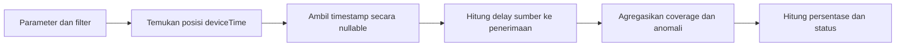

# Cakupan Timestamp Sumber dan Anomali Delay Ingesti pada Event Terurai

- **ID:** FSQ-DQ-001
- **Judul Inggris:** Parsed Event Source-Timestamp Coverage and Ingestion Delay Anomalies
- **Jenis:** FortiSIEM Advanced Search, ClickHouse SQL
- **Status privasi:** Tersanitasi
- **Status pengujian:** Belum dieksekusi secara independen pada lingkungan FortiSIEM

## Tujuan

Query ini menilai dua karakteristik event yang berhasil di-parse:

1. Seberapa banyak event memiliki timestamp sumber `deviceTime` yang dapat
   digunakan.
2. Seberapa banyak event memiliki delay sumber-ke-penerimaan yang negatif atau
   melampaui ambang yang ditentukan pengguna.

Query ini tidak mengukur seluruh kualitas ingestion. Secara khusus,
`eventParsedOk = 1` mengecualikan event yang gagal di-parse, sehingga hasil tidak
dapat dipakai sebagai parser success rate atau ukuran kelengkapan seluruh event
yang diterima.

## Parameter

Isi parameter hanya pada salinan lokal yang tidak dilacak Git.

| Parameter | Bentuk nilai | Kegunaan |
| --- | --- | --- |
| `PERIOD_START` | `YYYY-MM-DD HH:MM:SS` | Awal periode, inklusif |
| `PERIOD_END` | `YYYY-MM-DD HH:MM:SS` | Akhir periode, eksklusif |
| `TIMEZONE` | Nama zona waktu IANA | Interpretasi kedua batas periode |
| `CUSTOMER_NAME` | String | Nilai organisasi pada deployment target |
| `DELAY_THRESHOLD_SECONDS` | Bilangan bulat positif | Batas maksimum delay yang diterima |

`PERIOD_END` wajib lebih besar daripada `PERIOD_START`, dan delay threshold
wajib positif. Query menampilkan status invalid bila aturan ini dilanggar, tetapi
nilai tetap harus divalidasi sebelum eksekusi.

Pada FortiSIEM Advanced Search, pastikan atribut `deviceTime` tersedia dan, bila
tidak muncul langsung pada Database Schema, pilih melalui daftar **Attributes
used** sebelum menjalankan query.

## Alur Perhitungan

### 1. Parameter dan batas pencarian

Bagian awal `WITH` mengubah batas periode menjadi `DateTime`, menyimpan customer
target sebagai alias, dan mengubah delay threshold menjadi bilangan detik.

Filter menggunakan interval setengah terbuka `[period_start, period_end)`.
Pola ini mencegah event pada batas akhir terhitung dua kali ketika periode
laporan disusun berurutan.

### 2. `extracted_events`

CTE ini hanya membaca event yang:

- berada dalam batas `phRecvTime`;
- berasal dari customer target; dan
- memiliki `eventParsedOk = 1`.

`indexOf(metrics_datetime.name, 'deviceTime')` mencari posisi pertama atribut
`deviceTime`. ClickHouse menggunakan indeks array mulai dari 1 dan mengembalikan
0 bila elemen tidak ditemukan.

`arrayElementOrNull(metrics_datetime.value, source_time_index)` kemudian
mengambil nilai pada posisi yang sama. Penggunaan varian `OrNull` penting karena
posisi 0 atau posisi di luar panjang array menghasilkan `NULL`, bukan timestamp
default yang dapat disalahartikan sebagai nilai nyata.

### 3. `measured_events`

CTE ini menghitung delay dalam detik:

$$
\text{delay}_i = \text{phRecvTime}_i - \text{deviceTime}_i
$$

Urutan argumen `dateDiff('second', source_time, receive_time)` berarti hasil
adalah waktu penerimaan dikurangi waktu sumber.

- Delay positif berarti FortiSIEM menerima event setelah timestamp sumber.
- Delay negatif berarti timestamp sumber berada setelah waktu penerimaan.
- Delay `NULL` berarti timestamp sumber tidak dapat digunakan.

### 4. `statistics`

CTE ini menghasilkan hitungan berikut:

- seluruh event yang berhasil di-parse dan lolos filter;
- event yang nama atributnya memuat `deviceTime`;
- event yang memiliki nilai timestamp sumber yang dapat digunakan;
- event tanpa atribut timestamp sumber;
- event yang atributnya ditemukan tetapi nilai sejajarnya tidak tersedia;
- event dengan delay negatif; dan
- event dengan delay melampaui threshold.

Pemisahan antara atribut yang ditemukan dan nilai yang dapat digunakan membantu
mendeteksi kemungkinan ketidaksejajaran array `metrics_datetime.name` dan
`metrics_datetime.value`.

### 5. Hasil akhir

Persentase timestamp sumber yang dapat digunakan dihitung sebagai:

$$
\text{Usable Timestamp Percent} =
\frac{\text{Usable Source Timestamp Events}}
{\text{Parsed Events}} \times 100
$$

Jika tidak ada event terurai, persentase menjadi `NULL` dan status menjadi
`NO PARSED EVENTS`. Input periode atau threshold yang tidak valid memiliki
status tersendiri dan bukan hasil pengukuran kualitas.

## Kolom Hasil

| Kolom | Arti |
| --- | --- |
| `Parsed Events` | Seluruh event dengan `eventParsedOk = 1` dalam scope |
| `Source Timestamp Attribute Events` | Event yang memiliki nama atribut `deviceTime` |
| `Usable Source Timestamp Events` | Event dengan nilai `deviceTime` yang dapat digunakan |
| `Usable Source Timestamp Percent` | Persentase usable timestamp terhadap parsed events |
| `Missing Source Timestamp Events` | Event tanpa atribut `deviceTime` |
| `Unusable Source Timestamp Events` | Atribut ditemukan tetapi nilai sejajarnya tidak tersedia |
| `Negative Delay Events` | Event dengan timestamp sumber setelah waktu penerimaan |
| `Delay Over Threshold Events` | Event dengan delay lebih besar dari threshold |
| `Query Status` | Status validasi input atau ketersediaan event |

## Asumsi dan Keterbatasan

- `deviceTime` diasumsikan mewakili timestamp sumber yang relevan.
- Array nama dan nilai datetime diasumsikan sejajar. Ketidaksejajaran terdeteksi
  sebagai timestamp tidak dapat digunakan, tetapi penyebabnya tidak ditentukan.
- Jika `deviceTime` muncul lebih dari sekali, `indexOf` hanya memakai kemunculan
  pertama.
- Delay negatif dapat disebabkan clock skew, timezone sumber, mapping parser,
  atau timestamp yang memang berada di masa depan. Ini bukan bukti tunggal
  kegagalan pipeline ingestion.
- Delay besar dapat berasal dari buffering perangkat, konektivitas, forwarding,
  antrean, replay, parser, atau sumber data historis.
- `phRecvTime` adalah batas pencarian sekaligus waktu penerimaan yang dibandingkan;
  query tidak memecah delay per tahap pipeline.
- Agregasi mencakup seluruh event terurai customer dalam periode dan tidak
  dikelompokkan per collector, device, event type, atau sumber.
- Query hanya menghitung dua kelas anomali dan tidak menghasilkan distribusi,
  median, percentile, atau tren waktu.
- Hasil tidak mencakup event dengan `eventParsedOk` selain 1.

## Validasi yang Disarankan

Uji pada non-production dengan event sintetis yang hasilnya telah diketahui:

1. Event terurai dengan `deviceTime` sebelum `phRecvTime` dan di bawah threshold.
2. Event terurai tanpa `deviceTime`.
3. Nama `deviceTime` tersedia tetapi array nilainya lebih pendek.
4. `deviceTime` setelah `phRecvTime`; hasil harus masuk negative delay.
5. Delay tepat pada threshold dan satu detik di atas threshold. Operator `>`
   hanya menghitung kasus yang benar-benar melampaui batas.
6. Tidak ada parsed event dalam periode.
7. Periode sama/terbalik dan threshold nol/negatif.

Bandingkan hitungan terhadap sampel event yang telah disanitasi. Jangan
menempelkan hasil produksi ke issue, pull request, atau layanan AI.

## Catatan Performa

Query membatasi `phRecvTime` dan menggunakan filter equality pada `customer`.
Pemrosesan array datetime dan `dateDiff` tetap dilakukan pada setiap event yang
lolos filter. Gunakan periode sesempit mungkin, uji terlebih dahulu pada rentang
kecil, dan pertimbangkan filter indeks tambahan bila use case memang membatasi
event type, perangkat, atau collector tertentu.

## Referensi Resmi

- [Creating a New Advanced Search](https://docs.fortinet.com/document/fortisiem/7.5.1/user-guide/431900/creating-a-new-advanced-search)
- [Working with Event Attributes](https://docs.fortinet.com/document/fortisiem/7.5.1/user-guide/042752/working-with-event-attributes)
- [ClickHouse Query Optimization Guidelines](https://docs.fortinet.com/document/fortisiem/7.5.1/user-guide/953058/clickhouse-query-optimization-guidelines)
- [ClickHouse Array Functions](https://clickhouse.com/docs/sql-reference/functions/array-functions#indexof)
- [ClickHouse Date and Time Functions](https://clickhouse.com/docs/sql-reference/functions/date-time-functions#dateDiff)

Versi dokumentasi FortiSIEM yang dirujuk: **7.5.1**. Tanggal akses:
**11 Agustus 2026**. Periksa kembali dokumentasi resmi untuk versi deployment
yang digunakan.

Fortinet, FortiSIEM, dan merek terkait adalah milik pemegang mereknya. Proyek ini
independen dan tidak berafiliasi, disponsori, atau didukung oleh Fortinet.