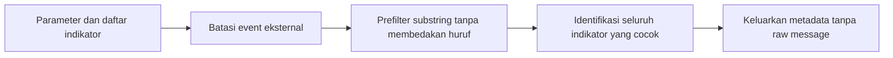

# Kecocokan Indikator Potensi SQL Injection pada Pesan Event Eksternal

- **ID:** FSQ-HUNT-001
- **Judul Inggris:** Potential SQL Injection Indicator Matches in External Event Messages
- **Jenis:** FortiSIEM Advanced Search, ClickHouse SQL
- **Status privasi:** Tersanitasi
- **Status pengujian:** Belum dieksekusi secara independen pada lingkungan FortiSIEM

## Tujuan

Query ini mencari substring yang sering dikaitkan dengan aktivitas SQL
injection pada `rawEventMsg` event eksternal, lalu menampilkan metadata yang
dapat digunakan analis untuk triage.

Hasil adalah **potential indicator match**, bukan bukti bahwa SQL injection
berhasil dilakukan, mencapai aplikasi, dieksekusi database, atau menimbulkan
dampak. Setiap hasil memerlukan validasi terhadap jenis log, parser, aplikasi,
dan konteks jaringan.

Untuk mengurangi paparan data, query sengaja tidak menampilkan `rawEventMsg`.
Pesan mentah dapat mengandung credential, token, cookie, parameter aplikasi,
data pribadi, atau isi request lainnya.

## Parameter

Isi parameter hanya pada salinan lokal yang tidak dilacak Git.

| Parameter | Bentuk nilai | Kegunaan |
| --- | --- | --- |
| `PERIOD_START` | `YYYY-MM-DD HH:MM:SS` | Awal periode, inklusif |
| `PERIOD_END` | `YYYY-MM-DD HH:MM:SS` | Akhir periode, eksklusif |
| `TIMEZONE` | Nama zona waktu IANA | Interpretasi kedua batas periode |
| `CUSTOMER_NAME` | String | Nilai organisasi pada deployment target |

`PERIOD_END` harus lebih besar daripada `PERIOD_START`. Gunakan periode pendek
terlebih dahulu karena pencarian substring pada raw event dapat membaca banyak
data. Pastikan `rawEventMsg`, `srcIpAddr`, dan `destIpAddr` tersedia melalui
**Attributes used** bila tidak tampil langsung pada Database Schema.

## Contoh Dummy Siap Copy-Paste

Buka [query.example.sql.tmpl](query.example.sql.tmpl), lalu salin seluruh isinya
ke **Analytics > Advanced Search > Query Console**. Contoh memakai:

| Parameter | Nilai dummy |
| --- | --- |
| Organisasi | `Dummy_Organisasi` |
| Period start | `2026-08-17 00:00:00` |
| Period end | `2026-08-18 00:00:00` |
| Timezone | `UTC` |

Query dummy dapat langsung di-format dan dijalankan, tetapi hasil kosong adalah
wajar karena organisasi dummy tidak nyata. Untuk penggunaan berwenang, ganti
dummy hanya pada salinan lokal di luar Git, lalu copy-paste seluruh query.

Jangan commit query yang telah diisi nilai nyata atau hasil pencariannya.

## Alur Perhitungan

### 1. Parameter dan `sql_injection_indicators`

Bagian awal `WITH` menetapkan periode setengah terbuka
`[period_start, period_end)`, customer target, dan daftar substring statis.

Daftar tersebut mencakup beberapa bentuk query gabungan, metadata database,
fungsi penundaan, prosedur sistem, komentar vendor, dan fungsi error-based yang
sering terlihat pada payload atau alert SQL injection. Daftar ini adalah
heuristik triage, bukan signature set yang lengkap.

### 2. `candidate_events`

CTE ini membaca event yang:

- berada dalam periode;
- berasal dari customer target;
- memiliki kategori `0`, yaitu external non-flow event menurut dokumentasi
  FortiSIEM;
- memiliki pesan mentah tidak kosong; dan
- cocok dengan sedikitnya satu indikator menggunakan
  `multiSearchAnyCaseInsensitive`.

Tidak ada filter `eventParsedOk = 1` karena pencarian dilakukan langsung pada
pesan mentah. Event yang tidak terurai sempurna masih dapat relevan untuk triage.

### 3. `matched_events`

Prefilter hanya menyatakan bahwa sedikitnya satu substring cocok. Agar analis
mengetahui alasan sebuah event muncul, `arrayFilter` dan
`positionCaseInsensitive` menyusun array seluruh indikator yang ditemukan pada
pesan tersebut.

Pencocokan tidak membedakan huruf besar dan kecil, tetapi tetap berupa pencarian
substring literal. Query tidak menampilkan isi pesan mentah.

### 4. Hasil akhir

Hasil diurutkan dari waktu penerimaan terbaru dan dibatasi 100 baris. Jumlah
indikator dihitung sebagai:

$$
\text{Matched Indicator Count}_i =
\left|\text{Matched Indicators}_i\right|
$$

Satu event dapat cocok dengan lebih dari satu indikator.

## Kolom Hasil

| Kolom | Arti |
| --- | --- |
| `Receive Time` | Waktu FortiSIEM menerima event |
| `Source IP` | Alamat sumber yang terurai dari event |
| `Destination IP` | Alamat tujuan yang terurai dari event |
| `Event Type` | Jenis event FortiSIEM |
| `Reporting Device` | Perangkat yang melaporkan event |
| `Matched Indicators` | Daftar substring statis yang cocok |
| `Matched Indicator Count` | Jumlah indikator berbeda yang cocok |

## Asumsi dan Keterbatasan

- Kecocokan substring dapat berasal dari serangan, pemindai keamanan, log
  aplikasi, pesan error, dokumentasi, query sah, atau data yang dikutip.
- Query tidak melakukan URL decoding, HTML decoding, Unicode normalization,
  deobfuscation komentar, atau canonicalization whitespace.
- Payload yang di-encode berulang, dipecah, disisipkan komentar, atau memakai
  variasi yang tidak ada pada daftar dapat tidak terdeteksi.
- Pencocokan case-insensitive ClickHouse mengikuti aturan huruf bahasa Inggris;
  daftar saat ini berisi karakter ASCII.
- Hanya external non-flow event kategori `0` yang dicari. Flow event dan event
  internal tidak masuk scope.
- Nilai IP dapat kosong atau tidak sesuai arah request, tergantung parser dan
  sumber log.
- Query tidak membedakan request yang diblokir, diizinkan, atau berhasil.
- Daftar indikator perlu ditinjau berdasarkan teknologi, parser, dan baseline
  lokal sebelum dipakai sebagai alert.
- IP, event type, reporting device, timestamp, dan pola hasil adalah informasi
  sensitif. Jangan mempublikasikan hasil query.
- Pencarian raw message dapat mahal pada periode panjang.

## Validasi yang Disarankan

Uji pada non-production dengan event sintetis dan benign control:

1. Satu indikator plain-text dengan variasi huruf besar dan kecil.
2. Satu indikator URL-encoded yang memang ada pada daftar.
3. Event yang cocok dengan dua indikator; array dan count harus berisi dua.
4. Teks SQL yang sah atau pesan dokumentasi untuk mengukur false positive.
5. Payload terobfuscasi atau double-encoded untuk menunjukkan false negative.
6. Event tanpa `rawEventMsg` dan event kategori selain `0`; keduanya harus
   dikeluarkan.
7. Periode terbalik; query harus menghasilkan nol baris.
8. Periode valid tanpa kecocokan; query harus menghasilkan nol baris.

Jangan menempelkan raw event produksi ke issue, pull request, dokumentasi, atau
layanan AI saat melakukan validasi.

## Catatan Performa

Query membatasi `phRecvTime`, customer, dan kategori sebelum mengidentifikasi
seluruh substring yang cocok. `multiSearchAnyCaseInsensitive` menjadi prefilter;
`arrayFilter` hanya dijalankan pada kandidat yang telah cocok.

Walaupun demikian, pencarian `rawEventMsg` tetap dapat memerlukan scan besar.
Mulai dengan periode pendek dan tambahkan filter event type atau reporting
device hanya bila scope tersebut memang bagian dari use case yang berwenang.

## Referensi Resmi

- [Creating a New Advanced Search](https://docs.fortinet.com/document/fortisiem/7.5.1/user-guide/431900/creating-a-new-advanced-search)
- [FortiSIEM Event Categories and Handling](https://docs.fortinet.com/document/fortisiem/7.5.1/user-guide/604340/fortisiem-event-categories-and-handling)
- [Working with Event Attributes](https://docs.fortinet.com/document/fortisiem/7.5.1/user-guide/042752/working-with-event-attributes)
- [ClickHouse Functions for Searching in Strings](https://clickhouse.com/docs/sql-reference/functions/string-search-functions)
- [OWASP SQL Injection](https://owasp.org/www-community/attacks/SQL_Injection)

Versi dokumentasi FortiSIEM yang dirujuk: **7.5.1**. Tanggal akses:
**11 Agustus 2026**. Periksa kembali dokumentasi resmi untuk versi deployment
yang digunakan.

Fortinet, FortiSIEM, dan merek terkait adalah milik pemegang mereknya. Proyek ini
independen dan tidak berafiliasi, disponsori, atau didukung oleh Fortinet.