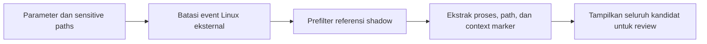

# Kecocokan Potensi Referensi File Kredensial Shadow Linux dengan Konteks Proses

- **ID:** FSQ-HUNT-002
- **Judul Inggris:** Potential Linux Shadow Credential-File Reference Matches with Process Context
- **Jenis:** FortiSIEM Advanced Search, ClickHouse SQL
- **Status privasi:** Tersanitasi
- **Status pengujian:** Belum dieksekusi secara independen pada lingkungan FortiSIEM

## Tujuan

Query ini mencari referensi case-insensitive ke `/etc/shadow` atau
`/etc/gshadow` pada pesan mentah event Linux eksternal. Kedua path berkaitan
dengan informasi autentikasi dan grup yang sensitif, sehingga referensinya dapat
berguna untuk triage credential access.

Hasil adalah **path reference match**, bukan bukti bahwa file berhasil dibaca,
disalin, diubah, atau digunakan untuk credential dumping. Konfirmasi memerlukan
atribut operasi file, hasil syscall, identitas proses/user, dan korelasi event
lainnya.

Query sengaja tidak menampilkan `rawEventMsg`. Pesan mentah dapat memuat data
sensitif. Hanya path yang cocok, nama proses yang diekstrak, dan marker konteks
statis yang ditampilkan.

## Parameter

Isi parameter hanya pada salinan lokal yang tidak dilacak Git.

| Parameter | Bentuk nilai | Kegunaan |
| --- | --- | --- |
| `PERIOD_START` | `YYYY-MM-DD HH:MM:SS` | Awal periode, inklusif |
| `PERIOD_END` | `YYYY-MM-DD HH:MM:SS` | Akhir periode, eksklusif |
| `TIMEZONE` | Nama zona waktu IANA | Interpretasi kedua batas periode |
| `CUSTOMER_NAME` | String | Nilai organisasi pada deployment target |

`PERIOD_END` harus lebih besar daripada `PERIOD_START`. Mulai dengan periode
pendek karena pencarian pesan mentah dapat mahal. Pastikan `rawEventMsg` dan
`reptDevIpAddrV4` tersedia melalui **Attributes used** bila tidak tampil pada
Database Schema.

## Contoh Dummy Siap Copy-Paste

Buka [query.example.sql.tmpl](query.example.sql.tmpl), lalu salin seluruh isinya
ke **Analytics > Advanced Search > Query Console**. Contoh memakai:

| Parameter | Nilai dummy |
| --- | --- |
| Organisasi | `Dummy_Organisasi` |
| Period start | `2026-08-17 00:00:00` |
| Period end | `2026-08-18 00:00:00` |
| Timezone | `UTC` |

Hasil kosong dengan data dummy adalah wajar. Untuk penggunaan berwenang, ganti
dummy hanya pada salinan lokal di luar Git, lalu copy-paste seluruh query.
Jangan commit query terisi atau hasil aktualnya.

## Alur Perhitungan

### 1. Parameter dan daftar statis

Bagian awal `WITH` menetapkan periode setengah terbuka
`[period_start, period_end)`, customer target, dua sensitive paths, serta daftar
known context markers.

Marker konteks mencakup beberapa agen monitoring dan nilai `comm` yang umum
terlihat pada aktivitas administratif. Marker tersebut bukan allowlist dan
tidak menyatakan event aman.

### 2. `candidate_events`

CTE ini membatasi data ke:

- periode dan customer target;
- external non-flow event kategori `0`;
- event type dengan prefix literal `LINUX_`;
- pesan mentah tidak kosong; dan
- pesan yang memuat sedikitnya satu sensitive path.

`startsWith` digunakan agar underscore pada `LINUX_` diperlakukan literal.
Ekspresi `LIKE 'LINUX_%'` tidak digunakan karena underscore dalam pola `LIKE`
adalah wildcard satu karakter.

Tidak ada filter `eventParsedOk = 1` karena pencarian dilakukan pada raw event.

### 3. `matched_events`

CTE ini:

- mengekstrak nilai pertama `comm="..."` sebagai nama proses;
- membentuk array seluruh sensitive path yang cocok; dan
- membentuk array seluruh known context marker yang cocok.

`extract` mengembalikan string kosong bila pola `comm` tidak tersedia. Ketiadaan
nama proses tidak berarti event tidak relevan.

### 4. Mengapa pengecualian dihapus

Query awal mengeluarkan event yang mengandung marker seperti `sudo`, `sshd`,
`cron`, atau agen monitoring. Pendekatan itu berisiko false negative: proses
umum dapat muncul dalam aktivitas sah maupun berbahaya, dan pesan dapat memuat
lebih dari satu proses atau konteks.

Versi ini tidak menghapus event berdasarkan marker. Semua kandidat tetap
ditampilkan. `Context Classification` hanya menunjukkan apakah marker yang
terdaftar ditemukan. Kedua nilai klasifikasi selalu menyatakan
`REVIEW REQUIRED`; marker tidak menurunkan prioritas secara otomatis.

### 5. Hasil akhir

Hasil diurutkan dari waktu terbaru dan dibatasi 100 baris. Raw message tidak
ditampilkan. Analis memperoleh metadata host, process name, matched paths, dan
context markers untuk menentukan langkah korelasi berikutnya.

## Kolom Hasil

| Kolom | Arti |
| --- | --- |
| `Receive Time` | Waktu FortiSIEM menerima event |
| `Reporting Device` | Perangkat yang melaporkan event, atau kosong |
| `Reporting Device IP` | Alamat reporting device yang terurai, atau kosong |
| `Event Type` | Jenis event FortiSIEM dengan prefix `LINUX_` |
| `Process Name` | Nilai pertama `comm` yang diekstrak, atau kosong |
| `Matched Sensitive Paths` | Path shadow yang ditemukan pada pesan |
| `Matched Context Markers` | Marker monitoring/proses yang ditemukan |
| `Context Classification` | Ada/tidaknya marker, bukan verdict benign/malicious |

## Asumsi dan Keterbatasan

- Referensi path dapat berasal dari file access, audit rule, command line,
  konfigurasi, pesan error, dokumentasi, monitoring, atau data yang dikutip.
- Query tidak membuktikan operasi baca, permission, keberhasilan syscall,
  privilege, identitas user, atau exfiltration.
- Regex `comm` mengikuti format audit tertentu dan dapat kosong atau mengambil
  kemunculan pertama yang bukan proses utama.
- Marker konteks menggunakan substring literal dan dapat cocok pada bagian teks
  lain; marker bukan allowlist atau penurunan severity otomatis.
- Daftar marker tidak lengkap. Ketiadaan marker bukan bukti malicious.
- Filter event type bergantung pada konvensi prefix `LINUX_` pada deployment.
- Query tidak melakukan decoding, normalisasi, atau korelasi multi-event.
- Reporting device/IP dan process name bergantung pada kualitas parser.
- Hostname, IP, timestamp, process, dan pola hasil adalah sensitif. Jangan
  mempublikasikan hasil query.
- Raw-message search dapat mahal pada periode panjang.

## Validasi yang Disarankan

Uji pada non-production dengan event sintetis dan benign controls:

1. Referensi `/etc/shadow` dengan variasi huruf.
2. Event yang memuat kedua sensitive paths.
3. Event dengan `comm` yang dapat diekstrak dan event tanpa `comm`.
4. Event yang mengandung marker monitoring; event harus tetap muncul.
5. Event yang mengandung `sudo`, `sshd`, atau `cron`; event harus tetap muncul.
6. Pesan konfigurasi atau dokumentasi untuk mengukur false positive.
7. Event type yang tidak berawalan literal `LINUX_`; event harus dikeluarkan.
8. Event kategori selain `0` dan pesan kosong; keduanya harus dikeluarkan.
9. Periode terbalik atau periode tanpa kecocokan; hasil harus kosong.

Jangan menempelkan raw event produksi ke issue, pull request, dokumentasi, atau
layanan AI saat melakukan validasi.

## Catatan Performa

Query membatasi `phRecvTime`, customer, kategori, dan prefix event type sebelum
melakukan prefilter dua path. `arrayFilter` untuk path dan marker hanya berjalan
pada kandidat yang telah cocok.

Pencarian `rawEventMsg` tetap dapat membaca volume data besar. Gunakan periode
pendek; mulai dari satu hari sebelum memperluas rentang. Tambahkan filter
host/event type hanya bila sesuai scope berwenang.

## Referensi Resmi

- [Creating a New Advanced Search](https://docs.fortinet.com/document/fortisiem/7.5.1/user-guide/431900/creating-a-new-advanced-search)
- [FortiSIEM Event Categories and Handling](https://docs.fortinet.com/document/fortisiem/7.5.1/user-guide/604340/fortisiem-event-categories-and-handling)
- [Working with Event Attributes](https://docs.fortinet.com/document/fortisiem/7.5.1/user-guide/042752/working-with-event-attributes)
- [ClickHouse Functions for Searching in Strings](https://clickhouse.com/docs/sql-reference/functions/string-search-functions)
- [MITRE ATT&CK T1003.008](https://attack.mitre.org/techniques/T1003/008/)
- [MITRE ATT&CK T1555](https://attack.mitre.org/techniques/T1555/)

Versi dokumentasi FortiSIEM yang dirujuk: **7.5.1**. Tanggal akses:
**11 Agustus 2026**. Periksa kembali dokumentasi resmi untuk versi deployment
yang digunakan.

Fortinet, FortiSIEM, dan merek terkait adalah milik pemegang mereknya. MITRE
ATT&CK adalah merek dagang The MITRE Corporation. Proyek ini independen dan
tidak berafiliasi, disponsori, atau didukung oleh Fortinet maupun MITRE.