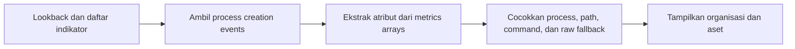

# Kecocokan Indikator Potensi Eksekusi Nmap pada Aset Seluruh Organisasi

- **ID:** FSQ-HUNT-003
- **Judul Inggris:** Potential Nmap Execution Indicator Matches Across Accessible Organizations
- **Jenis:** FortiSIEM Advanced Search, ClickHouse SQL
- **Cakupan:** Seluruh organisasi yang diizinkan oleh RBAC akun
- **Status privasi:** Tersanitasi
- **Status pengujian:** Logika ini telah menghasilkan data pada deployment pengguna, tetapi belum diuji independen oleh maintainer

## Tujuan

Query ini mencari event pembuatan proses Windows dan Linux yang memiliki
indikator `nmap`, `zenmap`, atau `nping` pada nama proses, path proses, command
line, atau raw event fallback. Hasil menampilkan organisasi dan aset tempat
indikator tersebut ditemukan.

Nmap adalah alat eksplorasi jaringan dan security/port scanner. Zenmap merupakan
GUI resmi Nmap, sedangkan Nping merupakan alat pembuatan paket dan analisis
respons. Penggunaan ketiganya dapat sah untuk administrasi, inventarisasi,
monitoring, vulnerability assessment, atau penetration testing.

Hasil adalah **potential execution indicator match**, bukan bukti bahwa scan
berhasil dijalankan, target tertentu dipindai, atau aktivitas bersifat jahat.
Konfirmasi membutuhkan review command line, otorisasi perubahan, user, parent
process, dan korelasi telemetry jaringan.

## Parameter

| Parameter | Bentuk nilai | Kegunaan |
| --- | --- | --- |
| `LOOKBACK_DAYS` | Bilangan bulat positif | Jumlah hari ke belakang dari waktu query dijalankan |

Template kanonik memakai placeholder `{{LOOKBACK_DAYS}}`. Nilai nol atau negatif
tidak menghasilkan event. Gunakan rentang sesingkat mungkin sebelum memperluas
pencarian lintas organisasi.

## Contoh Dummy Siap Copy-Paste

Buka [query.example.sql.tmpl](query.example.sql.tmpl), lalu salin seluruh isinya
ke **Analytics > Advanced Search > Query Console**. Contoh memakai lookback
`30` hari dan tidak memerlukan nama organisasi karena query sengaja mencakup
seluruh organisasi yang terlihat oleh akun.

Nilai 30 adalah contoh aman, bukan kebijakan tetap. Ubah hanya pada salinan
lokal di luar Git. Jangan commit hasil query atau salinan yang berisi data nyata.

## Alur Perhitungan

### 1. Periode dan indikator

`LOOKBACK_DAYS` diubah menjadi interval hari dari `now()`. Dua array statis
berisi nama proses dan substring untuk Nmap, Zenmap, serta Nping pada Windows dan
Linux.

### 2. `extracted_events`

CTE ini membaca kategori event eksternal `0` dan dua event type dari Process
Creation Data Model FortiSIEM:

- `Win-Sysmon-1-Create-Process`; dan
- `LINUX_PROCESS_EXEC`.

Tidak ada filter customer. `phCustId` dan `customer` dibawa ke hasil agar setiap
kecocokan tetap terikat pada organisasi asal. Data yang terlihat tetap dibatasi
oleh role dan RBAC akun FortiSIEM.

Atribut dinamis dibaca dari schema fisik:

- `metrics_string` untuk `hostName`, `user`, `shortProcName`, `procName`,
  `parentProcName`, dan `command`;
- `metrics_ip` untuk `hostIpAddr`; dan
- `rawEventMsg` sebagai fallback pencocokan.

`arrayElementOrNull` mencegah indeks yang tidak ditemukan menghasilkan nilai
default yang disalahartikan. Nilai kosong dipakai bila atribut tidak tersedia.

### 3. `evaluated_events`

Pencocokan dilakukan melalui empat jalur:

1. Nama proses pendek yang sama persis dengan daftar tool.
2. Substring pada full process path.
3. Substring pada command line.
4. Substring pada raw event sebagai fallback ketika parser tidak mengisi atribut.

Raw event hanya digunakan di dalam query dan tidak ditampilkan pada hasil.
`Raw Event Matches` berisi indikator statis yang cocok, bukan isi pesan mentah.

### 4. Hasil akhir

`Asset Name` memprioritaskan `hostName`, lalu memakai reporting device sebagai
fallback. `Asset IP` memprioritaskan `hostIpAddr`, lalu reporting IP.

`Detection Basis` menjelaskan jalur pencocokan. Satu event dapat memiliki lebih
dari satu basis dan indikator substring yang saling tumpang tindih.

Hasil diurutkan dari event terbaru dan dibatasi 300 baris.

## Kolom Hasil

| Kolom | Arti |
| --- | --- |
| `Organization ID` | ID tenant FortiSIEM |
| `Organization` | Nama organisasi pemilik event |
| `Asset Name` | Host name atau reporting device fallback |
| `Asset IP` | Host IP atau reporting IP fallback |
| `Receive Time` | Waktu FortiSIEM menerima event |
| `Event Type` | Event process creation Windows atau Linux |
| `User` | User yang terkait dengan pembuatan proses, bila tersedia |
| `Process Name` | Nama proses pendek, bila tersedia |
| `Process Path` | Full path proses, bila tersedia |
| `Parent Process Path` | Full path parent process, bila tersedia |
| `Command Line` | Command line proses, bila tersedia |
| `Path Matches` | Indikator yang cocok pada process path |
| `Command Matches` | Indikator yang cocok pada command line |
| `Raw Event Matches` | Indikator statis yang cocok pada raw event |
| `Detection Basis` | Sumber pencocokan indikator |
| `Reporting Device` | Perangkat yang mengirim event |
| `Reporting IP` | IP perangkat yang mengirim event |

## Asumsi dan Keterbatasan

- Event process creation harus tersedia dari Sysmon/FortiSIEM Windows Agent atau
  Linux Agent.
- Key metrics mengikuti Process Creation Data Model dan parser deployment.
- Raw-event fallback dapat menemukan teks pada pesan error, konfigurasi, atau
  data yang dikutip sehingga menghasilkan false positive.
- Nama file dapat diubah dan tool dapat dibungkus, di-memory-load, atau
  dieksekusi melalui binary lain sehingga tidak terdeteksi.
- Substring `nmap` dapat juga cocok sebagai bagian dari `zenmap`; ini hanya
  memengaruhi daftar indikator, bukan jumlah event.
- Query tidak membuktikan target, port, metode scan, hasil scan, atau dampaknya.
- Aktivitas red-team, vulnerability scanner, atau administrator yang sah dapat
  muncul pada hasil.
- Scanner eksternal tanpa telemetry endpoint tidak terlihat sebagai process
  creation. Gunakan telemetry firewall, IPS, atau NetFlow untuk perilaku scan.
- Seluruh organisasi berarti organisasi yang dapat dilihat akun sesuai RBAC,
  bukan bypass terhadap tenant isolation.
- Organization, asset, IP, user, command line, dan hasil query adalah sensitif.
  Jangan mempublikasikan hasil.

## Validasi yang Disarankan

Uji pada lingkungan berwenang dengan proses yang hasilnya telah diketahui:

1. Nama proses pendek `nmap` atau `nmap.exe`.
2. Full path yang memuat `nmap` ketika nama proses pendek kosong.
3. Command line Nmap ketika process path tidak tersedia.
4. Event yang hanya cocok melalui raw-event fallback.
5. Eksekusi Zenmap dan Nping.
6. Teks benign yang memuat kata `nmap` untuk mengukur false positive.
7. Event process creation tanpa indikator; event harus dikeluarkan.
8. Lookback nol; hasil harus kosong.
9. Akun dengan akses beberapa tenant; organization ID/name harus sesuai sumber.

Jangan menempelkan command line atau raw event produksi ke issue, pull request,
dokumentasi publik, atau layanan AI.

## Catatan Performa

Filter waktu, kategori, dan dua event type diterapkan sebelum pencocokan string.
Raw-event fallback tetap dapat menambah biaya. Mulai dari satu hari, lalu
perluas lookback hanya bila diperlukan.

## Referensi Resmi

- [Creating a New Advanced Search](https://docs.fortinet.com/document/fortisiem/7.5.1/user-guide/431900/creating-a-new-advanced-search)
- [Process Creation Data Model](https://docs.fortinet.com/document/fortisiem/7.5.1/fortisiem-event-data-model/892201/process-creation-data-model)
- [FortiSIEM Event Categories and Handling](https://docs.fortinet.com/document/fortisiem/7.5.1/user-guide/604340/fortisiem-event-categories-and-handling)
- [Nmap Reference Guide](https://nmap.org/book/man.html)
- [Zenmap GUI Users' Guide](https://nmap.org/book/zenmap.html)
- [Nping Reference Guide](https://nmap.org/book/nping-man.html)
- [MITRE ATT&CK T1046 Network Service Discovery](https://attack.mitre.org/techniques/T1046/)

Versi dokumentasi FortiSIEM yang dirujuk: **7.5.1**. Tanggal akses:
**12 Agustus 2026**. Periksa dokumentasi resmi untuk versi deployment Anda.

Fortinet, FortiSIEM, Nmap, Zenmap, Nping, dan MITRE ATT&CK adalah milik pemegang
hak atau mereknya masing-masing. Proyek ini independen dan tidak berafiliasi,
disponsori, atau didukung oleh pihak-pihak tersebut.